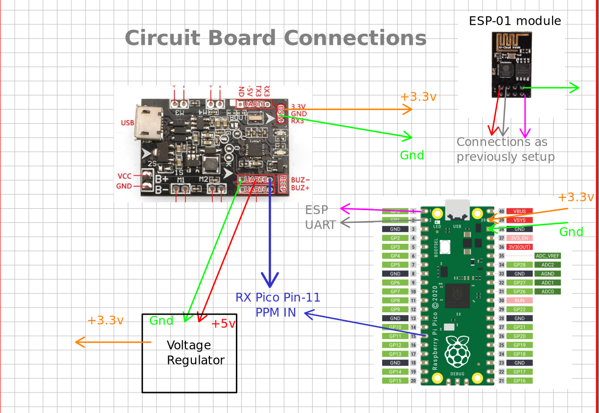

# NanoDrone-Hardware
Contains files for the firmware and hardware for NanoDrones

## Circuit Board

#Instructions

- 1. Use `FlashWrite.uf2` file in the `bin/` folder and input your Wifi credentials and Server Ip with port number all of them input with a enter or new line folloiwing those. This should be done through minicom or any similar serial interface

- 2. Use the `PicoESP.uf2` file in the `bin/` folder and connect the pin number `GPIO-11` to the UART 2 RX of the F3 flight controller. you may choose to power the pico board using a external regulator or the onboard power distribution.

## Add more INFO with diagram

