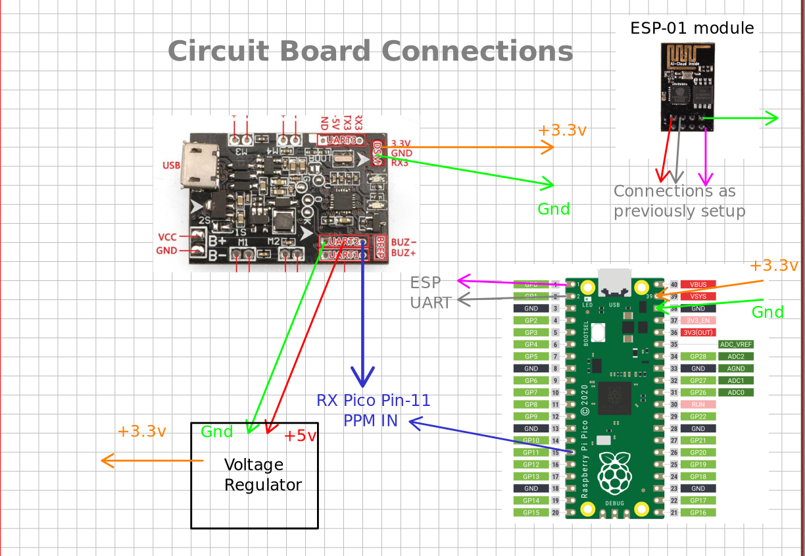
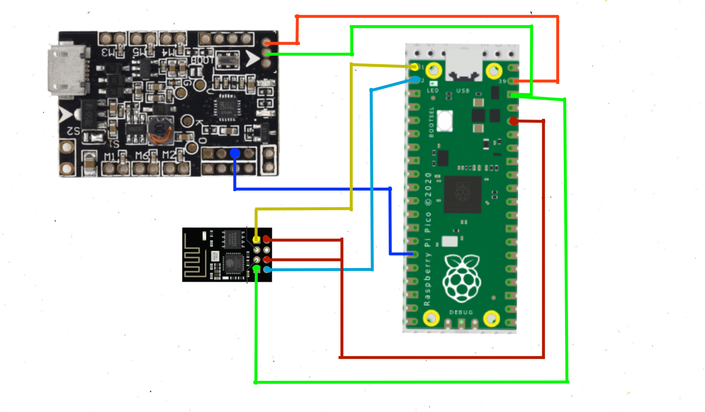

# NanoDrone-Hardware
Quad copters are rather the most simplest of all robots for degree of freedoms and mobility they are able to a achieve given a rather simple control equations.
Here we have tried to modify a simple mini drone platform crafted for FPV racing, to work with wireless commands sent from a ground station at minimum amount lag.

Our main goal is to be able to control these drones with ROS and be able to use this firmware to control them in formations as these are very capable robots limited by their on board computation and rather not on their actuations and sensings. So we would be having a Development on these quadcopters with ROS cum MavLink to be able to deploy algorithms developed with ROS middleware.

For the current approach we are using [`F3 Evo`](https://robu.in/product/f3-evo-v2-0-flight-control/) for the main flight controller with CleanFlight's latest firmware (v2.5.0 at the time of documentation). We are using [`Raspberry Pi Pico`](https://robu.in/product/raspberry-pi-pico/) mainly because of the two physical cores it offers which we have utilized to the fullest by splitting ondemanding tasks on each of them. We have also used a ['ESP-01`](https://robu.in/product/esp-01-esp8266-serial-wifi-wireless-transceiver-module/) for interfacing through LAN on WiFi.

### Final Result

Below are a few snap shots of the drone

Below is a demo of the drone being controlled using a remote teleop from our ground station [**Drive Link**](https://drive.google.com/file/d/1SyTdQoA_HoSc0vJoVNXdMnX6LYcKFTU4/view?usp=sharing)

## Implementation
Below I have explained about the Modifications only
### Circuit Board

This explains the connections between the FC and the Raspberrypi

## For the Connections follow this circuit diagram :

and additionally connect `GPIO11` of the PICO to `UART2` RX of the FC

### Execution Principal

#### Core 0
This has interrupts on the ESP constantly looking for input from the server and also parses them to update the PPM table. this core is also responsible for managing the Credentials of your Drone.

#### Core 1
This has its PPM cycles run by which this core is isolated from every other process as delay in any process return causes very noisy values in the output. We have also used this core to run the indicator LED in a sequence predefined to a given code. This is very neccesarry to run in this core as it is a good indicator if the PPM signal is perfectly being generated.

**Note: Donot turn on minicom or any such serial monitor as this slows done Cores and depreciating the performance of the PPM generator**

## Instructions

- 1. Use `FlashWrite.uf2` file in the `bin/` folder and input your Wifi credentials and Server Ip with port number all of them input with a enter or new line folloiwing those. This will write your wifi information, ip address and port number in the memory.This should be done through minicom or any similar serial interface.

- 2. Use `wifi_setup.uf2` file in the `bin/` folder.  This would setup the ESP on the given Wifi network with the given credentials. This has to be done only once.

- 3. Use the `PicoESP.uf2` file in the `bin/` folder and connect the pin number `GPIO-11` to the UART 2 RX of the F3 flight controller. you may choose to power the pico board using a external regulator or the onboard power distribution. There you go you have everything running.(If you ip address or port number is changed, use the `FlashWrite.uf2` file again and update the new credentials. No need to use `wifi_setup.uf2` again unless wifi network is not changed)

For running this launch the `server.py` or the joystick based server, now connect the pico to the drone and this should launch a controller like layout on your terminal now **Press 'F' to pay respects** and arm the drone. Use the joystick wisely.

## Contributors and Maintainers

<table>
 <td align="center">
     <a href="https://github.com/hex-plex">
     <b>Somnath Sendhil Kumar </b></a> 
    </td>
    <td align="center">
     <a href="https://github.com/aju22">
     <b>Arjun Krishna</b></a> 
	</td>
	<td align="center">
     <a href="https://github.com/jsparrow08">
     <b>Utkrisht Singh</b></a> 
	</td>

</table>

Please feel free to contact us for any quries and requrests. Thank you.
